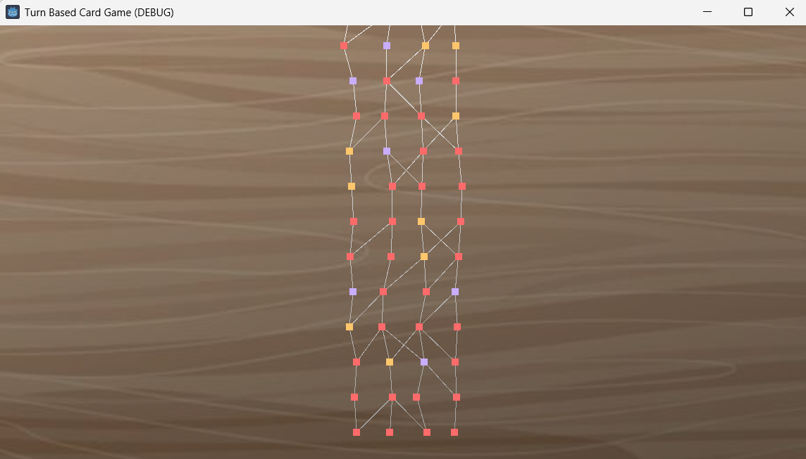
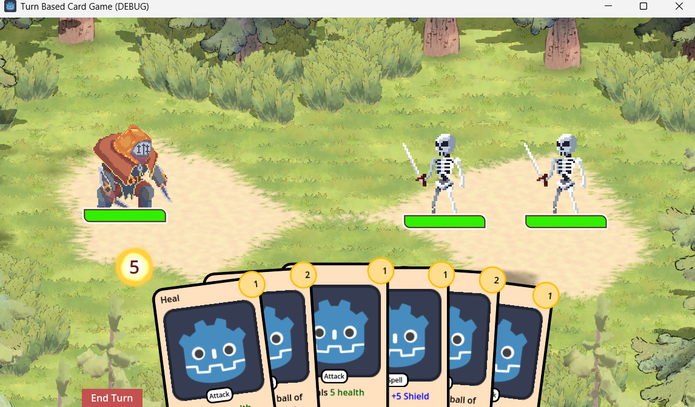
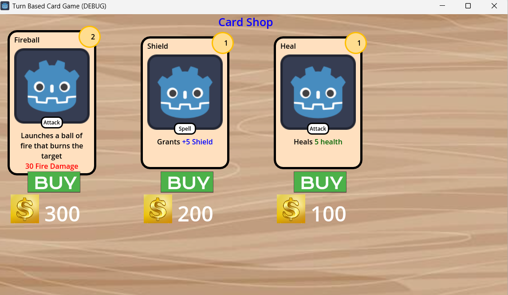

# Turn Based Strategy Card Game

> Our project is a two dimensional, turn based card inspired by many popular games over the decades, including Final Fantasy, Darkest Dungeon, and Slay The Spire. 

## Team 29

| Name | GitHub | Email |
|------|--------|-------|
| Dorian Vail | [@Dorianv5](https://github.com/Dorianv5) | dorian.vail@sjsu.edu |
| Vincent Cheng | [@vincentc168777](https://github.com/vincentc168777) | vincent.cheng@sjsu.edu |
| Sarmad Nasir | [@sarmadn](https://github.com/sarmadn) | sarmad.nasir@sjsu.edu |
| Surya Krishnamurthy | [@codinginc123](https://github.com/codinginc123) | surya.krishnamurthy@sjsu.edu |

**Advisor:** Bhawandeep Singh Harsh

---

## Problem Statement

There are many popular, two dimensional, turn-based card games that have been released over the past few years including Slay The Spire, Darkest Dungeon, Final Fantasy and Balatro. These games have great mechanics on an individual basis, but they each have their own set of drawbacks. Slay the Spire lacks top down movements, for instance while Darkest Dungeon does not have a card system. This means people will have to buy several games to experience all mechanics instead of just some.

## Solution

Our solution is to create a self-contained card game that combines mechanics from all the listed games above. It will have exciting combat like Slay The Spire, random encounters such as in Darkest Dungeon, and character control reminiscent of Final Fantasy. In addition, the game provides players with many chances to explore, plan and strategize in order to win. 

### Key Features

- Combat system: Used to alternate between combat scenarios. It is all-inclusive and has a card/upgrade shop. Must coordinate between combat mechanics, enemies and card outcomes.
- Enemy ai: Cards selected based on difficulty of enemy. The enemies will be in the form of artificial intelligence.
- Card effects/interactions: Cards are optimized and function in accordance with the combat system. Card interactions are improved to make gameplay smoother.
- Card & Upgrade shop: To buy cards with gold and upgrade them. Will be available with the click of a button from the combat scene where player(s) can access both to do as they wish.
- Deck system: It has card operations like shuffling and drawing cards. It has data structures like arrays, classes and sets. The deck system will coordinate with card effects and the combat system.

---

## Demo

[Link to demo video or GIF]

**Live Demo:** [URL if deployed]

---

## Screenshots

| Feature | Screenshot | 
|---------|------------| 
| Map generator |  | 
| Combat scene |  | 
| Card shop |  |
---

## Tech Stack

| Category | Technology |
|----------|------------|
| Frontend |Godot 4.5|
| Backend |GDScript|
| Database |Resource in Godot|
| Deployment |Github|

---

## Getting Started

### Prerequisites

- Godot 4.5
    - installation url: https://godotengine.org/download/windows/ 
- Operating Systems: Windows 11 
- Github for version control

### Installation

```bash
# Step 1. Clone the repository
git clone https://github.com/SJSU-CMPE-195/group-project-turn-based-card-game.git

# Step 2. Change directory
cd group-project-turn-based-card-game

# Step 3. 

### Running Locally

```bash
# Development mode
[dev command]

# The app will be available at http://localhost:XXXX
```

### Running Tests

```bash
[test command]
```

---

## API Reference

<details>
<summary>Click to expand API endpoints</summary>

| Method | Endpoint | Description |
|--------|----------|-------------|
| GET | `/api/resource` | Get all resources |
| GET | `/api/resource/:id` | Get resource by ID |
| POST | `/api/resource` | Create new resource |
| PUT | `/api/resource/:id` | Update resource |
| DELETE | `/api/resource/:id` | Delete resource |

</details>

---

## Project Structure

```
.
├── [folder]/           # Description
├── src/                # Source code files
├── tests/              # Test files
├── docs/               # Documentation files
└── README.md
```

---

## Contributing

1. Create a feature branch (`git checkout -b feature/amazing-feature`)
2. Commit your changes (`git commit -m 'Add amazing feature'`)
3. Push to the branch (`git push origin feature/amazing-feature`)
4. Open a Pull Request

### Branch Naming

- `feature/` - New features
- `fix/` - Bug fixes
- `docs/` - Documentation updates
- `refactor/` - Code refactoring

### Commit Messages

Use clear, descriptive commit messages:
- `Add user authentication endpoint`
- `Fix database connection timeout issue`
- `Update README with setup instructions`

---

## Acknowledgments

- [Resource/Library/Person]
- [Resource/Library/Person]

---

## License

This project is licensed under the <FILL IN> License - see the [LICENSE](LICENSE) file for details.

---

*CMPE 195A/B - Senior Design Project | San Jose State University | Spring 2026*
